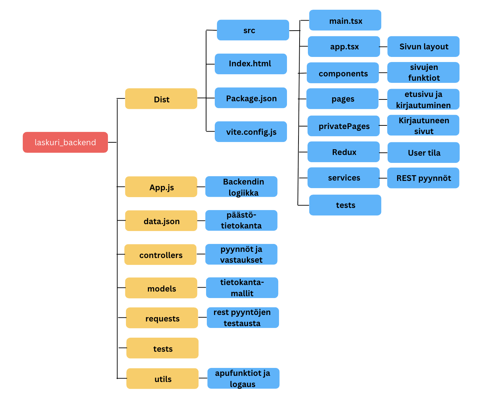

# Päästölaskuri

Päästölaskentaohjelmisto rakennusyhtiöille. 
Kirjautuminen ja käyttäjänluonti ominaisuudet. Käyttäjä pystyy luomaan projekteja, jotka tallennetaan erilliseen tietokantaan. 
Hyödyntää dataa https://co2data.fi/rakentaminen/ tietokannasta. Laskuriin valitaan rakennusmateriaali, sekä neliömäärä. Tämän jälkeen ohjelmisto laskee päästöjen määrän tietokannan perusteella ja summaa projektissa käytettyjen materiaalien päästöt.
Materiaalit lisätään yksi kerrallaan tiedostoksi, jonka voi tallentaa pdf muodossa. Kokonaisuus tallentuu automaattisesti tietokantaan, kun projektiin lisätään tai poistetaan materiaaleja. 

## Projektin pyörittäminen lokaalisti ja uuden version julkaisu

Projekti toimii npm kirjaston avulla. 
Asenna ensin npm riipuvuudet npm install komennolla.
Backendissä .env tiedoston avulla on määritelty portti PORT= muuttujana ja tietokantayhteys MONGODB_URI=, sekä jwt:n käyttämä tokenin luomis arvo SECRET=.  
pyörittääksesi projektia lokaalisti täytyy käynnistää backend ja frontend npm run dev komennolla. 
Vite config tiedostossa proxy, jotta api pyynnöt toimivat lokaalisti. 

Uuden version vieminen tuotantoon tapahtuu backendissä komennolla npm run deploy:full. Luo tuotantoversion frontista, siirtää sen backendiin ja julkaisee githubiin. Renderin pitäisi tunnistaa uusi committi ja päivittää sivusto. 

## Tekninen kuvaus

Frontend toimii react vitellä, hyödyntäen react routeria. Tilanhallinta on toteutettu suurimmaksi osaksi useState ja useEffect hookkien avulla, mutta user käyttää redux toolkittiä. Backend toimii restful periaatteella. Backend tehty node.js ja expressillä. Tietokantayhteydet mongoose kirjastolla. Tietokantana MongoDB Atlas. co2 tietokannan data tallennettu json tiedostona backendiin. Fronttia testattu vitestin ja react testing libraryn yhdistelmällä. Backendiä node:testillä, sekä api:ta supertest kirjastolla. 

Kirjautuminen toimii token perusteisesti hyödyntäen jwt kirjastoa, tallentaen tokenin frontissa lokalstorageen tunnin aikarajalla. Salasana hashatty bcrypt kirjastolla. 

## Tiedostorakenne

